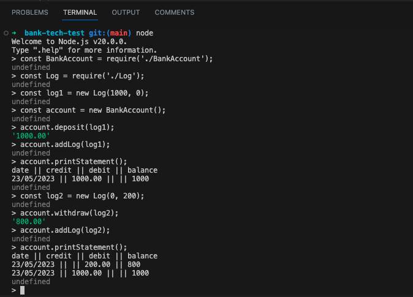
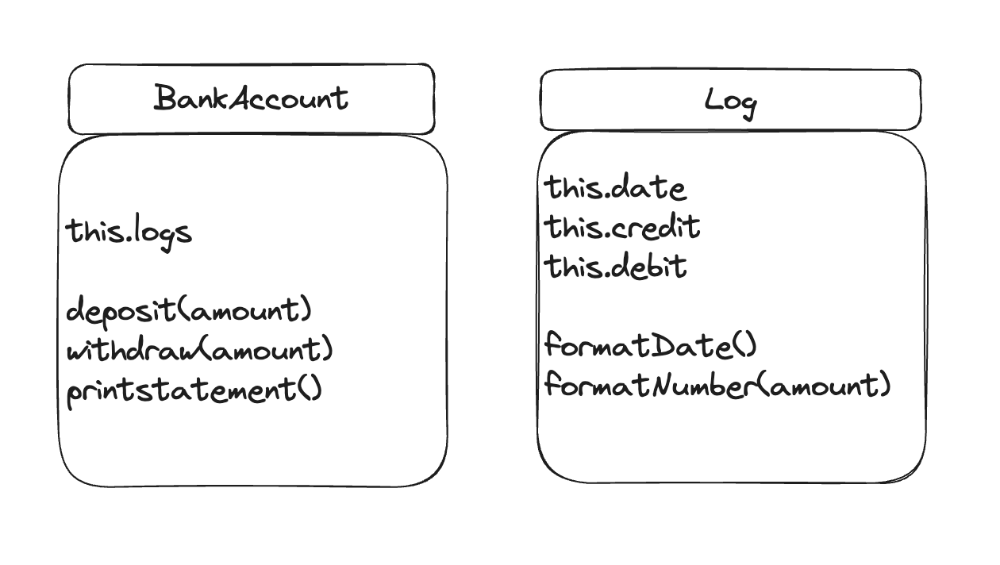

# Bank tech test

## Introduction

This program provides a simple Bank Account system using JavaScript classes. It consists of two classes: `BankAccount` and `Log`.

`BankAccount` class is responsible for managing its balance and transaction logs. It has methods for depositing, withdrawing, adding log entries, and printing the statement.

`Log` class is responsible for a single transaction log entry. its store the credit or the debit amounts and transaction date, and formats the log entry based on the acceptance criteria.

A `BankAccount` will then have many instances of the `Log` Class.



## Objective

This is a practice tech test with Makers. To practice my Object-Oriented design and Test-Driven Development skills.

## Specification

### Requirements

* You should be able to interact with your code via a REPL like IRB or Node.  (You don't need to implement a command line interface that takes input from STDIN.)
* Deposits, withdrawal.
* Account statement (date, amount, balance) printing.
* Data can be kept in memory (it doesn't need to be stored to a database or anything).

### Acceptance criteria

* **Given** a client makes a deposit of 1000 on 10-01-2023  
* **And** a deposit of 2000 on 13-01-2023  
* **And** a withdrawal of 500 on 14-01-2023  
* **When** she prints her bank statement  
* **Then** she would see

```
date || credit || debit || balance
14/01/2023 || || 500.00 || 2500.00
13/01/2023 || 2000.00 || || 3000.00
10/01/2023 || 1000.00 || || 1000.00
```

## Initial Planning



## How to run the project

### Dependencies

Before running the project, ensure that you have installed npm and node in your local machine. If they are not installed, please follow the steps below.

* npm

  ```bash
  npm install npm@latest -g
  npm -v
  ```

* nvm & node

  ```bash
  brew install nvm
  nvm install node
  node -v
  ```

### Installation

### Installation

* Clone the repo

   ```bash
   git clone https://github.com/maddc0de/bank-tech-test
   ```

* Install NPM packages

   ```bash
   cd bank-tech-test
   npm install
   ```

---

### How to run the tests

* run tests

  ```bash
  jest
  ```
  